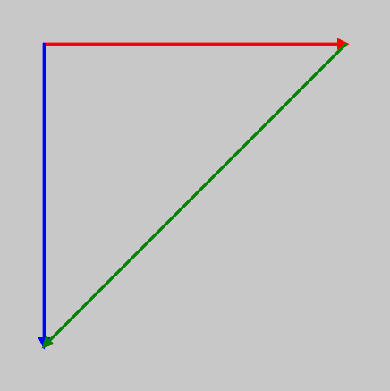

## Introducción 📜

En esta unidad repasarás el concepto de vector y algunas de sus operaciones básicas y experimentarás
con conceptos matemáticos y físicos, como velocidad y aceleración, para controlar el movimiento en
tus proyectos interactivos.

## Set: ¿Qué aprenderás en esta unidad? 💡

En esta unidad aprenderás una técnica fundamental para controlar el movimiento de los objetos visuales 
de tus creaciones interactivas. Se trata del marco motion 101. Este marco no solo será útil en esta unidad, 
sino que también te acompañará en las siguientes unidades, ya que es una técnica esencial para el desarrollo
de proyectos interactivos. Y no solo eso, sino que podrás aplicar esta técnica en cualquier lenguaje de programación,
o entorno de desarrollo, ya que es un concepto universal en la programación de gráficos y animaciones. Lo mejor 
de todo es que para aplicar esta técnicas no necesitas un motor de físicas.

### Actividad 01

#### Introducción a los vectores

En esta actividad vamos a repasar algunos conceptos básicos de los vectores. Te propondré que analicemos 
juntos algunos de los ejemplos del texto de guía.


Comencemos por el ejemplo: [Example 1.2: Bouncing Ball with Vectors!](https://natureofcode.com/vectors/#example-12-bouncing-ball-with-vectors)


:::caution[📤 Bitácora] 
1. ¿Cómo funciona la suma dos vectores en p5.js?
2. ¿Por qué esta línea position = position + velocity; no funciona?
:::

### Actividad 02

#### Repasa

Realiza este ejercicio del libro [Exercise 1.1](https://natureofcode.com/vectors/#exercise-11) 

:::caution[📤 Bitácora]
1. ¿Qué tuviste que hacer para hacer la conversión propuesta?
2. Muestra el código que utilizaste para resolver el ejercicio.
:::

## Seek: Investigación 🔎

### Actividad 03

#### Experimenta

Dale una mirada a este código:

``` js
let position;

function setup() {
    createCanvas(400, 400);
    position = createVector(6,9);
    console.log(position.toString());
    playingVector(position);
    console.log(position.toString());
    noLoop();
}

function playingVector(v){
    v.x = 20;
    v.y = 30;
}

function draw() {
    background(220);
    console.log("Only once");
}

```

:::caution[📤 Bitácora]

1. ¿Qué resultado esperas obtener en el programa anterior?
2. ¿Qué resultado obtuviste?
3. Recuerda los conceptos de paso por valor y paso por referencia en programación. Muestra ejemplos de este concepto en 
javascript. 
4. ¿Qué tipo de paso se está realizando en el código?
5. ¿Qué aprendiste?
::: 


### Actividad 04

#### Explora posibilidades

Vamos a darle una mirada a la clase p5.Vector [aquí](https://p5js.org/reference/p5/p5.Vector/).

:::caution[📤 Bitácora]
1. ¿Para qué sirve el método mag()? Nota que hay otro método llamado magSq(). ¿Cuál es la diferencia entre ambos? ¿Cuál es más eficiente?
2. ¿Para qué sirve el método normalize()?
3. Te encuentras con un periodista en la calle y te pregunta ¿Para qué sirve el método dot()? ¿Qué le responderías en un frase?
4. El método dot() tiene una versión estática y una de instancia. ¿Cuál es la diferencia entre ambas?
5. Ahora el mismo periodista curioso de antes te pregunta si le puedes dar una intuición geométrica acerca del producto cruz. 
Entonces te pregunta ¿Cuál es la interpretación geométrica del producto cruz de dos vectores? Tu respuesta debe incluir qué pasa con la orientación y la magnitud del vector resultante.
6. ¿Para que te puede servir el método dist()?
7. ¿Para qué sirven los métodos normalize() y limit()?
:::

### Actividad 05

##### Interpolamos?

Vas a tomar como inspiración este ejemplo de la referencia de p5.js:

``` js
function setup() {
    createCanvas(100, 100);
}

function draw() {
    background(200);

    let v0 = createVector(50, 50);
    let v1 = createVector(30, 0);
    let v2 = createVector(0, 30);
    let v3 = p5.Vector.lerp(v1, v2, 0.5);
    drawArrow(v0, v1, 'red');
    drawArrow(v0, v2, 'blue');
    drawArrow(v0, v3, 'purple');
}

function drawArrow(base, vec, myColor) {
    push();
    stroke(myColor);
    strokeWeight(3);
    fill(myColor);
    translate(base.x, base.y);
    line(0, 0, vec.x, vec.y);
    rotate(vec.heading());
    let arrowSize = 7;
    translate(vec.mag() - arrowSize, 0);
    triangle(0, arrowSize / 2, 0, -arrowSize / 2, arrowSize, 0);
    pop();
}
```

Vas a modificarlo para generar este resultado:



- Analiza cómo funciona el método lerp(). 
- Nota que además de la interpolación lineal de vectores, también puedes hacer interpolación lineal de colores con el método lerpColor().

Dedica un tiempo a estudiar cómo se dibuja una flecha en el método drawArrow().

:::caution[📤 Bitácora]
En tu bitácora escribe:

1. El código que genera el resultado que te pedí.
2. ¿Cómo funciona lerp() y lerpColor().
3. ¿Cómo se dibuja una flecha usando drawArrow()?
:::

### Actividad 06

#### Motion 101

En la sección del texto guía llamada [Motion with vectors](https://natureofcode.com/vectors/#motion-with-vectors), 
el autor propone un marco de movimiento llamado motion 101. Así mismo, el [ejemplo 1.7](https://natureofcode.com/vectors/#example-17-motion-101-velocity) 
muetra cómo se aplica este marco en un ejemplo simple.

:::caution[📤 Bitácora]
1. Cuál es el concepto del marco motion 101 y cómo se interpreta geométricamente.
2. ¿Cómo se aplica motion 101 en el ejemplo?
:::

### Actividad 07

#### Experimentando con la aceleración

En el libro proponen una regla (que eventualmente se rompe cuando conviene):

The goal for programming motion is to come up with an algorithm for calculating acceleration and then let the trickle-down effect work its magic.

Para investigador el significado de esta frase te propone que construyas un experimento donde analices cómo se comporta un objeto en movimiento con:

- Aceleración constante.
- Aceleración aleatoria.
- Aceleración hacia el mouse.

:::caution[📤 Bitácora]
1. ¿Qué observaste cuando usas cada una de las aceleraciones propuestas?
:::

## Apply: Aplicación 🛠

En esa fase vas a aplicar los conceptos investigados y vas a crear una pieza de arte generativo interactivo 
en tiempo real usando vectores y el marco motion 101.


### Actividad 08

####  Creación de obra generativa

Vas a crear una obra generativa interactivo en tiempo real que 
utilice los conceptos de motion 101, vectores y algunos algoritmos de la unidad
anterior. Vas a probar un algorimo para calcular la aceleración diferente a los 
que analizaste en esta unidad.

:::caution[📤 Bitácora]
En tu bitácora:

1. Describe el concepto de tu obra generativa.
2. ¿Cómo piensas aplicar el marco MOTION 101 y por qué?
3. ¿Qué algoritmo de aceleración vas a utilizar? ¿Por qué?
4. El contenido generado debe ser interactivo. Puedes utilizar mouse, teclado, cámara, micrófono, 
etc, para variar los parámetros del algoritmo en tiempo real.
5. El código de la aplicación.
6. Un enlace al proyecto en el editor de p5.js.
7. Una captura de pantalla representativa de tu pieza de arte generativo.
:::


## Reflect: Consolidación y metacognición 🤔

### Actividad 09

#### Autoevaluación

:::caution[📤 Bitácora]
Sin consultar tus notas, responde desde tu memoria:

**Parte 1: recuperación de conocimiento (Retrieval Practice)**

1. Escribe la "receta" del marco MOTION 101.
2. ¿Cómo se relaciona el marco MOTION 101 con los conceptos de position, velocidad y aceleración?
3. Si tuvieras que explicar el concepto de motion 101 de manera geométrica, ¿Cómo lo harías?

**Parte 2: reflexión sobre tu proceso (Metacognición)**

1. ¿Qué fue lo más desafiante en la Actividad 08? ¿El concepto creativo, la implementación del algoritmo de aceleración o la integración de la interactividad?
2. ¿Tu algoritmo de aceleración produjo el efecto que esperabas? Describe un momento "sorpresa" (esperado o inesperado) durante su desarrollo.
3. ¿Cómo ha cambiado tu forma de pensar sobre el "movimiento" en una pantalla después de esta unidad?
4. Si tuvieras una semana más, ¿qué mejorarías o qué otro algoritmo de aceleración te gustaría experimentar?
:::

### Actividad 10
  
#### Coevaluación

Dar feedback técnico y conceptual es una habilidad clave. Analiza el trabajo de un compañero para ayudarle a mejorar y para aprender de sus soluciones.

:::caution[📤 Bitácora]
1.  Intercambia la URL de tu bitácora con un compañero.
2.  Analiza su **Actividad 08**. Ejecuta su sketch, lee su concepto y revisa su código.
3.  En tu propia bitácora, escribe una retroalimentación constructiva para tu compañero, evaluando:
    *   **Claridad del Concepto:** ¿La obra visual refleja la intención descrita?
    *   **Implementación Técnica:** ¿Se aplica correctamente el marco MOTION 101? ¿Es el código legible y está bien estructurado?
    *   **Creatividad del Algoritmo:** ¿El algoritmo de aceleración es interesante y genera un comportamiento único?
    *   **Calidad de la Interactividad:** ¿La interacción es intuitiva y tiene un impacto significativo en la obra?
4.  Conversa con tu compañero sobre tu feedback.
:::

### Actividad 11

#### Feedback

Tu perspectiva me ayuda a refinar y mejorar esta unidad.

:::caution[📤 Bitácora]

Responde con total sinceridad:

1.  **Continuar:** ¿Qué actividad o concepto de esta unidad te resultó más "iluminador" o útil?
2.  **Dejar de hacer:** ¿Hubo alguna actividad que te pareció redundante o menos efectiva?
3.  **Empezar a hacer:** ¿Qué te gustaría explorar a continuación? ¿Más fuerzas físicas (fricción, resortes), sistemas de partículas, o algo más?
4.  **Método de aprendizaje:** ¿El paso de los experimentos guiados (Seek) a la aplicación libre (Apply) te pareció una transición natural y efectiva? ¿Por qué?
5.  **Comentario adicional:** ¿Algo más que quieras compartir sobre tu experiencia en esta unidad?
:::

